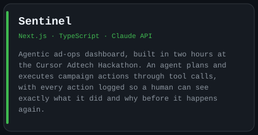
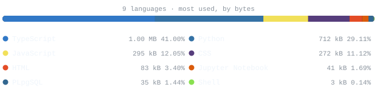

<picture>
  <source media="(prefers-color-scheme: dark)" srcset="assets/hero-dark.svg">
  <source media="(prefers-color-scheme: light)" srcset="assets/hero-light.svg">
  
</picture>

 

 

## `~/` about me 

Final-year Computer Science student at Royal Holloway, University of London, building products
that started from something I actually ran into myself.

I build AI systems for problems I've lived through, so the next person doesn't have to figure it out alone.

- Currently building [Threshold](https://github.com/dakshkumar96/Threshold): UK visa sponsor analysis,
  matching live job postings to Skilled Worker sponsors and ranking them by licence stability, built
  after struggling to find this information myself as an international student
- Built [Sakha](https://github.com/dakshkumar96/Sakha), a citation-grounded, voice-first RAG companion
  for the Bhagavad Gita
- Co-authored [rv-ml](https://github.com/George-Pulickan/rv-ml), using conformal prediction to put
  real uncertainty bounds on exoplanet orbital estimation, submitted to AAAI 2027
## `~/` toolbox
###

  
  
  
  
  
  
  
  
  
  
  
  
  
  
  
  
  
  
  
  
  
  
  
  
  

###

## `~/` skill-radar

<table>
<tr>
<td width="50%" align="center">
  <b>How I See Myself</b> 
<picture>
  <source media="(prefers-color-scheme: dark)" srcset="assets/radar-dark.svg">
  <source media="(prefers-color-scheme: light)" srcset="assets/radar-light.svg">
  
</picture>

</td>
<td width="50%" align="center">
  <b>What I Actually Ship</b> 
<picture>
  <source media="(prefers-color-scheme: dark)" srcset="assets/radar-langs-dark.svg">
  <source media="(prefers-color-scheme: light)" srcset="assets/radar-langs-light.svg">
  
</picture>

</td>
</tr>
</table>

 

## `~/` featured-work

<table>
<tr>
<td width="50%">
<a href="https://github.com/George-Pulickan/rv-ml">
<picture>
  <source media="(prefers-color-scheme: dark)" srcset="assets/card-rv-ml-dark.svg">
  <source media="(prefers-color-scheme: light)" srcset="assets/card-rv-ml-light.svg">
  
</picture>
</a>
</td>
<td width="50%">
<a href="https://github.com/dakshkumar96/Sakha">
<picture>
  <source media="(prefers-color-scheme: dark)" srcset="assets/card-sakha-dark.svg">
  <source media="(prefers-color-scheme: light)" srcset="assets/card-sakha-light.svg">
  
</picture>
</a>
</td>
</tr>
<tr>
<td width="50%">
<a href="https://github.com/dakshkumar96/Threshold">
<picture>
  <source media="(prefers-color-scheme: dark)" srcset="assets/card-threshold-dark.svg">
  <source media="(prefers-color-scheme: light)" srcset="assets/card-threshold-light.svg">
  
</picture>
</a>
</td>
<td width="50%">
<a href="https://github.com/dakshkumar96/Sentinel">
<picture>
  <source media="(prefers-color-scheme: dark)" srcset="assets/card-sentinel-dark.svg">
  <source media="(prefers-color-scheme: light)" srcset="assets/card-sentinel-light.svg">
  
</picture>
</a>
</td>
</tr>
</table>

 

## `~/` activity

<picture>
  <source media="(prefers-color-scheme: dark)" srcset="assets/commit-line-dark.svg">
  <source media="(prefers-color-scheme: light)" srcset="assets/commit-line-light.svg">
  
</picture>

 

<picture>
  <source media="(prefers-color-scheme: dark)" srcset="assets/card-stats-dark.svg">
  <source media="(prefers-color-scheme: light)" srcset="assets/card-stats-light.svg">
  
</picture>

 

## `~/` languages

live from the GitHub API

<picture>
  <source media="(prefers-color-scheme: dark)" srcset="assets/numbers-dark.svg">
  <source media="(prefers-color-scheme: light)" srcset="assets/numbers-light.svg">
  
</picture>
