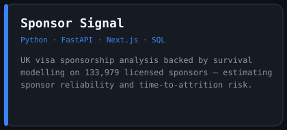
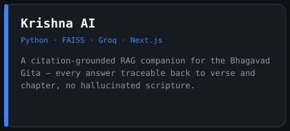
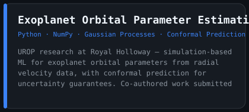
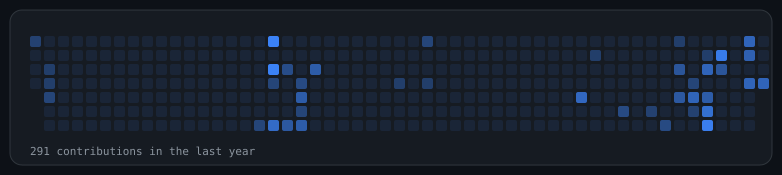

<div align="center">

<picture>
  <source media="(prefers-color-scheme: dark)" srcset="assets/portrait.svg">
  <source media="(prefers-color-scheme: light)" srcset="assets/portrait.svg">
  
</picture>

<br/>


<br/><br/>

<a href="https://linkedin.com/in/dakshkumar96"></a>
<a href="mailto:dakshkumar2k2@gmail.com"></a>
<a href="https://marketing-portfolio-beta.vercel.app"></a>


</div>

<br/>

## `~/` whoami

```console
$ cat about.txt
```

Hi, I'm **Daksh**. Final-year Computer Science student at Royal Holloway, University of London. I build data
products and AI systems that get used, not just demoed — usually starting from a problem I've actually run into
myself.

- Currently building **[Sponsor Signal](https://github.com/dakshkumar96/sponsor-signal)** — UK visa sponsorship
  analysis, backed by survival modelling on 133,979 licensed sponsors
- Also building **[Krishna AI](https://github.com/dakshkumar96/krishna-ai)** — a citation-grounded RAG
  companion for the Bhagavad Gita
- Recently: co-authored research applying conformal prediction to exoplanet orbital estimation, submitted to AAAI
- Final year project: Value at Risk — classical vs ML approaches to financial risk, backtested on real market data

<br/>

## Toolbox


<br/><br/>

## Skill radar — self-rated vs. what I actually ship

<table>
<tr>
<td width="50%" align="center">
<picture>
  <source media="(prefers-color-scheme: dark)" srcset="assets/radar-dark.svg">
  <source media="(prefers-color-scheme: light)" srcset="assets/radar-light.svg">
  
</picture>
<br/><sub>self-rated</sub>
</td>
<td width="50%" align="center">
<picture>
  <source media="(prefers-color-scheme: dark)" srcset="assets/radar-langs-dark.svg">
  <source media="(prefers-color-scheme: light)" srcset="assets/radar-langs-light.svg">
  
</picture>
<br/><sub>from real bytes in my repos</sub>
</td>
</tr>
</table>

<br/>

## Featured work

<table>
<tr>
<td width="50%">
<a href="https://github.com/dakshkumar96/sponsor-signal">
<picture>
  <source media="(prefers-color-scheme: dark)" srcset="assets/card-sponsor-signal-dark.svg">
  <source media="(prefers-color-scheme: light)" srcset="assets/card-sponsor-signal-light.svg">
  
</picture>
</a>
</td>
<td width="50%">
<a href="https://github.com/dakshkumar96/krishna-ai">
<picture>
  <source media="(prefers-color-scheme: dark)" srcset="assets/card-krishna-ai-dark.svg">
  <source media="(prefers-color-scheme: light)" srcset="assets/card-krishna-ai-light.svg">
  
</picture>
</a>
</td>
</tr>
<tr>
<td width="50%">
<a href="https://github.com/dakshkumar96/exoplanet-conformal-prediction">
<picture>
  <source media="(prefers-color-scheme: dark)" srcset="assets/card-exoplanet-conformal-prediction-dark.svg">
  <source media="(prefers-color-scheme: light)" srcset="assets/card-exoplanet-conformal-prediction-light.svg">
  
</picture>
</a>
</td>
<td width="50%">
<!-- fourth project slot — VaR repo once it exists, or leave this cell empty -->
</td>
</tr>
</table>

<sub>

**Sponsor Signal** — Python, FastAPI, Next.js, SQL · [live](https://your-deployed-url.vercel.app) · [repo](https://github.com/dakshkumar96/sponsor-signal)
**Krishna AI** — Python, FAISS, Groq, Next.js · [repo](https://github.com/dakshkumar96/krishna-ai)
**Exoplanet Orbital Parameter Estimation** — Python, conformal prediction · [repo](https://github.com/dakshkumar96/exoplanet-conformal-prediction)

</sub>

<br/>

## Activity

<picture>
  <source media="(prefers-color-scheme: dark)" srcset="assets/metrics.dark.svg">
  <source media="(prefers-color-scheme: light)" srcset="assets/metrics.light.svg">
  
</picture>

<picture>
  <source media="(prefers-color-scheme: dark)" srcset="assets/commit-line-dark.svg">
  <source media="(prefers-color-scheme: light)" srcset="assets/commit-line-light.svg">
  
</picture>

<picture>
  <source media="(prefers-color-scheme: dark)" srcset="https://raw.githubusercontent.com/dakshkumar96/dakshkumar96/output/snake-dark.svg">
  <source media="(prefers-color-scheme: light)" srcset="https://raw.githubusercontent.com/dakshkumar96/dakshkumar96/output/snake-light.svg">
  
</picture>

<br/>

<div align="center">
<picture>
  <source media="(prefers-color-scheme: dark)" srcset="assets/card-stats-dark.svg">
  <source media="(prefers-color-scheme: light)" srcset="assets/card-stats-light.svg">
  
</picture>
</div>
