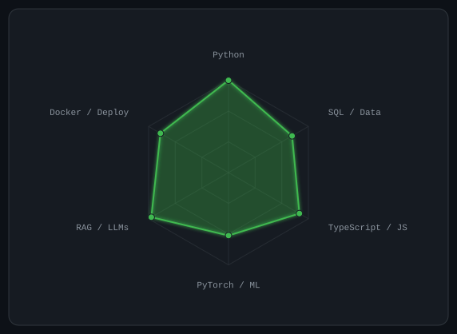
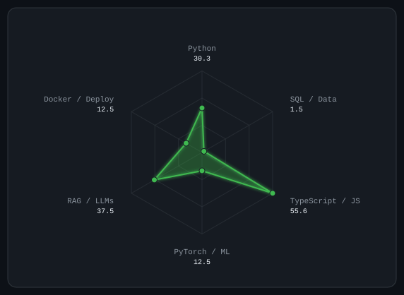
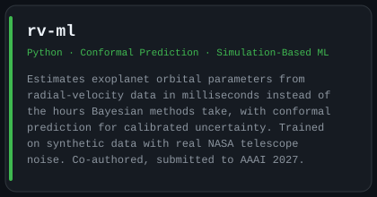
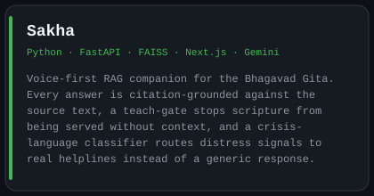
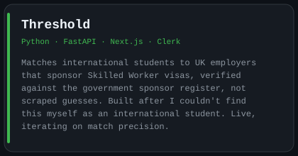
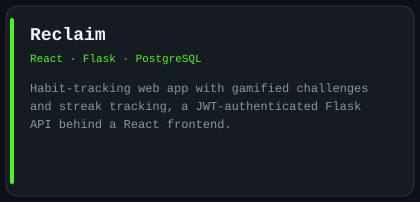
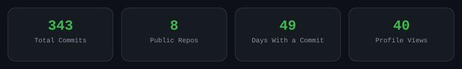

<div align="left">

# Hi, I'm Daksh

<br/><br/>

<a href="https://linkedin.com/in/dakshkumar96"></a>
<a href="mailto:dakshkumar2k2@gmail.com"></a>
<a href="https://marketing-portfolio-beta.vercel.app"></a>


</div>

<br/>

## `~/` whoami

```console
$ cat about.txt
```

Final-year Computer Science student at Royal Holloway, University of London. I build data products and AI
systems that get used, not just demoed, usually starting from a problem I've actually run into myself.

- Currently building **[Threshold](https://github.com/dakshkumar96/Threshold)**: UK visa sponsor analysis,
  matching live job postings to Skilled Worker sponsors and ranking them by licence stability
- Also building **[Sakha](https://github.com/dakshkumar96/Sakha)**, a citation-grounded, voice-first
  companion for the Bhagavad Gita
- Recently: co-authored **[rv-ml](https://github.com/George-Pulickan/rv-ml)**, applying conformal prediction
  to exoplanet orbital estimation, submitted to AAAI
- Final year project: Value at Risk, classical vs ML approaches to financial risk, backtested on real market data

<br/>

## `~/` how-i-think

- **Creative before rigorous.** I sketch the shape of a thing before I open an IDE, the same instinct that had me
  hand-design this profile's terminal aesthetic instead of reaching for a template.
- **Then I make it hold up.** 150+ LeetCode problems, 50+ Project Euler challenges, 3rd at the District Maths
  Olympiad, not puzzle-solving for its own sake, but the habit of decomposing a hard problem into steps I can
  actually verify, which is the same thing as scoping a feature properly.
- I'd rather ship something smaller that's correct than something bigger I can't explain line by line.

<br/>

## `~/` skill-radar

<sub>self-rated vs. what I actually ship</sub>

<table>
<tr>
<td width="50%" align="center">
<picture>
  <source media="(prefers-color-scheme: dark)" srcset="assets/radar-dark.svg">
  <source media="(prefers-color-scheme: light)" srcset="assets/radar-light.svg">
  
</picture>
<br/><sub>self-rated</sub>
</td>
<td width="50%" align="center">
<picture>
  <source media="(prefers-color-scheme: dark)" srcset="assets/radar-langs-dark.svg">
  <source media="(prefers-color-scheme: light)" srcset="assets/radar-langs-light.svg">
  
</picture>
<br/><sub>from real bytes in my repos</sub>
</td>
</tr>
</table>

<br/>

## `~/` featured-work

<table>
<tr>
<td width="50%">
<a href="https://github.com/George-Pulickan/rv-ml">
<picture>
  <source media="(prefers-color-scheme: dark)" srcset="assets/card-rv-ml-dark.svg">
  <source media="(prefers-color-scheme: light)" srcset="assets/card-rv-ml-light.svg">
  
</picture>
</a>
</td>
<td width="50%">
<a href="https://github.com/dakshkumar96/Sakha">
<picture>
  <source media="(prefers-color-scheme: dark)" srcset="assets/card-sakha-dark.svg">
  <source media="(prefers-color-scheme: light)" srcset="assets/card-sakha-light.svg">
  
</picture>
</a>
</td>
</tr>
<tr>
<td width="50%">
<a href="https://github.com/dakshkumar96/Threshold">
<picture>
  <source media="(prefers-color-scheme: dark)" srcset="assets/card-threshold-dark.svg">
  <source media="(prefers-color-scheme: light)" srcset="assets/card-threshold-light.svg">
  
</picture>
</a>
</td>
<td width="50%">
<a href="https://github.com/dakshkumar96/Reclaim">
<picture>
  <source media="(prefers-color-scheme: dark)" srcset="assets/card-reclaim-dark.svg">
  <source media="(prefers-color-scheme: light)" srcset="assets/card-reclaim-light.svg">
  
</picture>
</a>
</td>
</tr>
</table>

<br/>

## `~/` activity

<picture>
  <source media="(prefers-color-scheme: dark)" srcset="assets/commit-line-dark.svg">
  <source media="(prefers-color-scheme: light)" srcset="assets/commit-line-light.svg">
  
</picture>

<br/>

<div align="center">
<picture>
  <source media="(prefers-color-scheme: dark)" srcset="assets/card-stats-dark.svg">
  <source media="(prefers-color-scheme: light)" srcset="assets/card-stats-light.svg">
  
</picture>
</div>
